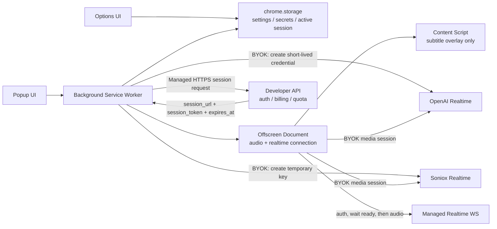

# Current State

Last updated: 2026-05-18 JST

This document records the current architecture, implementation status, security posture, and remaining work for Personal Realtime Interpreter.

## Product Direction

Personal Realtime Interpreter is a Chrome Manifest V3 extension for realtime translation of browser tab audio, mainly for web meetings and video viewing.

Current primary use case:

- Translate the other speaker / video audio into the user's language.
- Show translated subtitles.
- Play translated audio when the selected provider supports it.

Deferred future candidate:

- Translate the user's own microphone speech into the other party's language.
- This is intentionally on hold for the current phase.
- It is heavier than the current browser-tab translation scope because it requires microphone capture, TTS or speech-to-speech output, meeting audio injection or virtual microphone routing, and additional consent/privacy UX.
- Treat it as a possible future module, not as part of the current MVP or paid-service foundation.

## Service Modes

### BYOK

BYOK means Bring Your Own Key.

- User provides their own OpenAI or Soniox API key.
- Standard provider API keys stay in trusted extension contexts.
- Background Service Worker creates short-lived credentials.
- Offscreen Document receives only short-lived credentials.
- Content Script never receives API keys, short-lived tokens, audio, or passphrases.

### Managed

Managed is the future paid-service path.

- Extension calls the developer-operated API over HTTPS.
- Developer API validates auth, billing, quota, and provider access server-side.
- Developer API returns only a short-lived realtime session.
- Extension does not store provider API keys, billing credentials, or refresh tokens.
- Managed mode is disabled unless the build has a valid HTTPS session URL and exact manifest host permission.

Managed session response contract:

```json
{
  "session_url": "wss://managed.example.test/realtime",
  "session_token": "short-lived-token",
  "expires_at": "2026-05-18T00:01:00.000Z"
}
```

Managed realtime WebSocket contract:

- `session_url` must use `wss://`.
- `session_url` must not include query or fragment token data.
- The origin must match the configured/derived allowed realtime origin.
- Extension sends an auth message with `session_token`.
- Extension waits for `ready` or `session.ready` before streaming tab audio.

## Architecture



## Trusted Boundaries

Trusted extension contexts:

- Background Service Worker
- Options page
- Popup page
- Offscreen Document

Lower-trust context:

- Content Script

Rules:

- Content Script is display-only.
- Content Script does not read `chrome.storage`.
- Content Script does not make network requests.
- Content Script receives status/subtitle messages only.
- Transcript rendering uses safe text rendering, not unsafe HTML insertion.

## Implemented

- Vite + React + TypeScript Chrome MV3 project.
- OpenAI BYOK realtime translation path.
- Soniox BYOK realtime subtitle path.
- Service mode setting: `byok` / `managed`.
- Provider setting: OpenAI / Soniox.
- Managed session service in Background.
- Managed realtime WebSocket peer in Offscreen.
- Popup and Options UI for BYOK/Managed switching.
- Session-only and encrypted-local key storage design.
- Trusted storage access restriction.
- Redaction for OpenAI keys, ephemeral keys, temporary keys, bearer tokens, JWT-like tokens, and managed session tokens.
- Offscreen document detection using `chrome.runtime.getContexts` when available.
- Offscreen document cleanup through `chrome.offscreen.closeDocument()`.
- Active session state persisted to `chrome.storage.session` for MV3 service worker restart resilience.
- CSP `connect-src` for current provider endpoints.
- Manual QA checklist.
- Security documentation.

## Security Checks Completed

Automated checks run successfully:

```text
npm.cmd run typecheck
npm.cmd test
npm.cmd run build
```

Latest result:

- Typecheck: passed
- Tests: 123 passed
- Build: passed

Static checks:

- No `<all_urls>` in manifest.
- No `tabs`, `cookies`, `webRequest`, `debugger`, or `unlimitedStorage` permissions.
- Content Script has no storage access, fetch calls, or secret-like fields.
- Secret scan found only test dummy keys.

## Current Security Position

Acceptable for local MVP QA:

- BYOK provider keys are not sent to Content Script or Offscreen.
- Offscreen receives only short-lived credentials.
- Managed mode does not send audio until server readiness is confirmed.
- Managed mode rejects unsafe HTTPS/WSS configuration.
- Extension has narrow permissions.
- No audio/transcript persistence is implemented.

Not yet production-complete:

- Managed backend auth, billing, quota, and CSRF protections are not implemented in this repository.
- Managed translated-audio return protocol is not finalized.
- Chrome Web Store privacy disclosures are not finalized.
- Service Worker restart resilience is improved but still needs browser-runtime QA.

## Remaining Work

High priority before broader release:

- Real-device QA in Brave/Chrome with loaded `dist/`.
- BYOK Soniox QA with valid key. This is the current real-test path because OpenAI API access is unavailable.
- BYOK OpenAI QA with funded API access. This is deferred until an OpenAI API key and billing access are available.
- Managed mode QA against a real developer API stub.
- Confirm `chrome.storage.*.setAccessLevel` behavior in target browsers.
- Confirm Offscreen cleanup after stop/error/tab close.

Managed paid-service backend work:

- User authentication.
- Subscription/payment integration.
- Entitlement and quota checks.
- Short-lived session issuance.
- Provider-key custody server-side.
- Rate limiting and abuse controls.
- Secure cookie or bearer-token strategy.
- CSRF protection if cookie-based auth is used.
- Billing/admin dashboard.

Future feature work:

- Deferred: microphone speech translation for web meetings.
- Deferred: translated speech output back to the meeting.
- Soniox translated voice output if backend/protocol supports it.
- Versioned managed realtime protocol with capabilities such as transcripts, remote audio, and audio format negotiation.

## Important Build Notes

Default build:

- Managed mode remains disabled unless `VITE_MANAGED_SESSION_URL` is configured.

Managed release build:

- `VITE_MANAGED_SESSION_URL` must be HTTPS.
- Manifest `host_permissions` must include only the exact managed API origin.
- If managed realtime WebSocket uses a different origin, set `VITE_MANAGED_REALTIME_ORIGIN` to the exact `wss://...` origin.
- CSP must allow only the exact managed HTTPS/WSS endpoints.

Avoid:

- `<all_urls>`
- broad wildcard host permissions
- storing standard provider keys outside trusted contexts
- logging secrets
- persisting audio or transcript content
